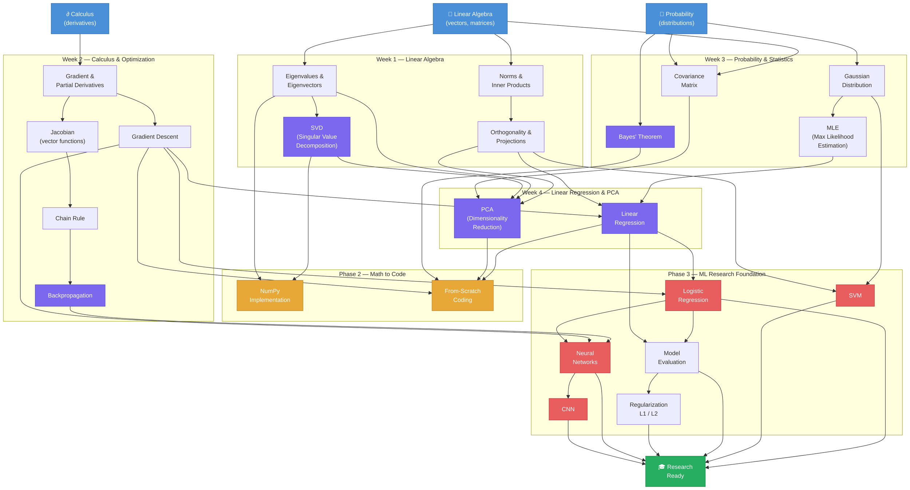

# Knowledge Graph — Mathematical Concept Dependencies

> This graph shows how each concept builds on previous ones.
> Read it top-to-bottom: you must understand a node before the ones pointing away from it.

---

## Color Legend

| Color | Meaning |
|-------|---------|
| 🔵 Blue | Foundation concepts (must know first) |
| 🟣 Purple | Core ML math (Week 1–4) |
| 🟡 Orange | Phase 2 — coding skills |
| 🔴 Red | Phase 3 — ML models |
| 🟢 Green | Final goal |
